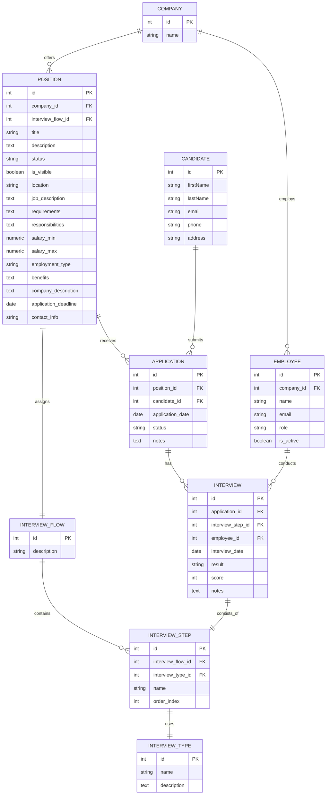

# Prompts to update the LTI database

## Prompt to prepare the prompt to update the schema

/meta-prompt

Role: Expert on relational databases. Expert on PostgreSQL. Expert using Prisma.

Description:

Having the following entity-relationship diagram:

erDiagram
     COMPANY {
         int id PK
         string name
     }
     EMPLOYEE {
         int id PK
         int company_id FK
         string name
         string email
         string role
         boolean is_active
     }
     POSITION {
         int id PK
         int company_id FK
         int interview_flow_id FK
         string title
         text description
         string status
         boolean is_visible
         string location
         text job_description
         text requirements
         text responsibilities
         numeric salary_min
         numeric salary_max
         string employment_type
         text benefits
         text company_description
         date application_deadline
         string contact_info
     }
     INTERVIEW_FLOW {
         int id PK
         string description
     }
     INTERVIEW_STEP {
         int id PK
         int interview_flow_id FK
         int interview_type_id FK
         string name
         int order_index
     }
     INTERVIEW_TYPE {
         int id PK
         string name
         text description
     }
     CANDIDATE {
         int id PK
         string firstName
         string lastName
         string email
         string phone
         string address
     }
     APPLICATION {
         int id PK
         int position_id FK
         int candidate_id FK
         date application_date
         string status
         text notes
     }
     INTERVIEW {
         int id PK
         int application_id FK
         int interview_step_id FK
         int employee_id FK
         date interview_date
         string result
         int score
         text notes
     }

     COMPANY ||--o{ EMPLOYEE : employs
     COMPANY ||--o{ POSITION : offers
     POSITION ||--|| INTERVIEW_FLOW : assigns
     INTERVIEW_FLOW ||--o{ INTERVIEW_STEP : contains
     INTERVIEW_STEP ||--|| INTERVIEW_TYPE : uses
     POSITION ||--o{ APPLICATION : receives
     CANDIDATE ||--o{ APPLICATION : submits
     APPLICATION ||--o{ INTERVIEW : has
     INTERVIEW ||--|| INTERVIEW_STEP : consists_of
     EMPLOYEE ||--o{ INTERVIEW : conducts

I want you to:
- Use relational database good practices to enrich the ERD provided
- Analyse the backend/prisma/schema.prisma file to update it following the ERD provided.
- You can use the mcp server dbhub to review the current database status, if needed.

### Result:

#### Role

You are an expert in relational database design, PostgreSQL, and Prisma ORM.

---

#### Objective

Enrich the provided ERD with relational database best practices, then update schema.prisma to fully implement the enriched model.

---

#### Context

**Current schema.prisma** contains only four models: `Candidate`, `Education`, `WorkExperience`, and `Resume`. It uses PostgreSQL as the provider via Prisma.

**Target ERD** (Mermaid):



---

#### Tasks

##### Task 1 — Enrich the ERD with relational database best practices

Apply the following improvements before touching any code:

1. **Audit fields** — Add missing standard fields to each entity:
   - `createdAt` / `updatedAt` timestamps on every table.
   - `deletedAt` (soft-delete) where logically appropriate (e.g., `Candidate`, `Application`).
2. **Data types** — Refine generic types (`string` → `VARCHAR(n)`, `text`, `boolean`; `numeric` → `DECIMAL(10,2)`; `date` → `TIMESTAMP WITH TIME ZONE`).
3. **Constraints** — Identify and declare:
   - `NOT NULL` vs. nullable fields.
   - `UNIQUE` constraints (e.g., `Employee.email`, `Candidate.email`, `Company.name`).
   - `CHECK` constraints where applicable (e.g., `salary_min <= salary_max`, `score` range 0–100, `order_index > 0`).
4. **Indexes** — List indexes to add for performance (FK columns, frequently filtered columns like `status`, `application_date`).
5. **Referential integrity** — Confirm cascade rules for all FK relationships (e.g., what happens to `Application` if a `Candidate` is deleted?).
6. **Normalization** — Flag any denormalization risks (e.g., `company_description` inside `POSITION` duplicates `COMPANY.name` data).

Produce a **brief justification** for each enrichment decision.

---

##### Task 2 — Update schema.prisma

Using the enriched ERD from Task 1:

1. **Preserve** all four existing models (`Candidate`, `Education`, `WorkExperience`, `Resume`) and their current field definitions, extending `Candidate` as needed.
2. **Add** all new models: `Company`, `Employee`, `Position`, `InterviewFlow`, `InterviewStep`, `InterviewType`, `Application`, `Interview`.
3. **Map** each model to its correct PostgreSQL table name using `@@map`.
4. **Apply** the enriched constraints:
   - Use `@db.VarChar(n)` for bounded strings, `@db.Text` for unbounded text, `@db.Decimal(10,2)` for salary fields, `@db.Timestamp(6)` or `DateTime` for timestamps.
   - Declare `@unique` where identified in Task 1.
   - Add `@@index([...])` blocks for all recommended indexes.
   - Set explicit cascade rules via `onDelete` / `onUpdate` on all relation fields.
5. **Add** `createdAt DateTime @default(now())` and `updatedAt DateTime @updatedAt` to every new model.
6. **Do not** change the Prisma `generator` or `datasource` blocks.

---

#### Constraints

- Output only the complete, final content of schema.prisma — no partial diffs.
- Follow Prisma schema syntax exactly (valid for Prisma 5+).
- Do not introduce breaking changes to the four existing models unless strictly required by the ERD.
- If you use the `dbhub` MCP server to inspect the live database, include a brief note of what you observed before producing the schema.

---

#### Expected Output

1. **ERD Enrichment Summary** — A concise table or bullet list of every addition/change made in Task 1 with its justification.
2. **Complete schema.prisma** — The full updated file, ready to run `prisma migrate dev`.

## Prompt to generate the changes

Result from previous prompt

### Result:

**Task 1 — ERD Enrichment Summary:**

| Entity | Enrichment | Justification |
|---|---|---|
| All new models | `createdAt`, `updatedAt` | Audit trail standard |
| `Candidate`, `Application` | `deletedAt` (soft-delete) | Preserve history; GDPR compliance |
| `Company.name` | `@unique` | Business rule: company names must be distinct |
| `Employee.email` | `@unique` | One account per person |
| `InterviewType.name` | `@unique` | Prevents duplicate type definitions |
| `Application` | `@unique([positionId, candidateId])` | Candidate can only apply once per position |
| `InterviewStep` | `@unique([interviewFlowId, orderIndex])` | No duplicate step ordering within a flow |
| `salary_min/max` | `Decimal @db.Decimal(10,2)` | Accurate financial representation |
| `score` | `Int?` (0–100, enforced at app level) | Prisma has no native CHECK; document constraint |
| `order_index` | `Int` (> 0, enforced at app level) | Same as above |
| `Position.companyDescription` | Kept as nullable snapshot | Denormalization risk noted — serves as point-in-time snapshot at posting time |
| All FKs on existing models | `onDelete: Restrict, onUpdate: Cascade` | Already applied in DB; made explicit in schema |
| New FK cascade rules | `Cascade` for `Interview→Application`; `Cascade` for `InterviewStep→InterviewFlow`; `Restrict` elsewhere | Interviews are owned by their Application; steps are owned by their flow |
| Indexes | Added on all FKs + `status`, `applicationDate`, `interviewDate`, `isActive`, `isVisible` | Query performance on common filter patterns |

Replacing 57 lines with 215 lines in [](file:///Users/alconesp/Development/ai4devs/AI4Devs-db-202603-Seniors/backend/prisma/schema.prisma)


```

```
Now let's validate the schema compiles correctly:

Ran terminal command:  cd /Users/alconesp/Development/ai4devs/AI4Devs-db-202603-Seniors/backend && npx prisma validate
Completed with input:  cd /Users/alconesp/Development/ai4devs/AI4Devs-db-202603-Seniors/backend && npx prisma validate

Schema is valid. Here's a summary of everything done:

---

**Task 1 — ERD Enrichment Summary**

| Category | Change | Justification |
|---|---|---|
| **Timestamps** | `createdAt`/`updatedAt` on all new models; same on `Candidate` | Audit trail, sorting, cache invalidation |
| **Soft-delete** | `deletedAt` on `Candidate` and `Application` | Preserve interview history; GDPR right-to-erasure via nullification |
| **UNIQUE** | `Company.name`, `Employee.email`, `InterviewType.name` | Business keys that must be distinct |
| **UNIQUE composite** | `Application(positionId, candidateId)` | Prevents duplicate applications |
| **UNIQUE composite** | `InterviewStep(interviewFlowId, orderIndex)` | Prevents duplicate ordering within a flow |
| **Data types** | `Decimal @db.Decimal(10,2)` for `salaryMin`/`salaryMax` | Exact financial arithmetic |
| **Data types** | `@db.Text` for long content; `@db.VarChar(n)` for bounded strings | Correct PostgreSQL storage classes |
| **Cascade rules** | `Interview → Application`: `onDelete: Cascade` | Interviews are owned by their application |
| **Cascade rules** | `InterviewStep → InterviewFlow`: `onDelete: Cascade` | Steps are owned by their flow |
| **Cascade rules** | All other FKs: `onDelete: Restrict` | Prevent accidental orphaning |
| **Indexes** | FK columns + `status`, `applicationDate`, `interviewDate`, `isActive`, `isVisible` | Covers common WHERE/ORDER BY patterns |
| **Normalization note** | `Position.companyDescription` kept nullable | Acknowledged denormalization — serves as snapshot of company info at posting time |
| **Constraints (app-level)** | `score` 0–100, `orderIndex > 0`, `salaryMin ≤ salaryMax` | Prisma has no native CHECK; documented in comments |

**Task 2** — schema.prisma updated and validated (`prisma validate` passes). Ready to run `prisma migrate dev`.

## Prompt to apply database normalization, because it has not apply it with the prompt provided

Review the schema generated to apply database normalization

### Result:

**Normalization changes applied to** schema.prisma

#### 1. 3NF violation fixed — `Position.companyDescription` removed

`companyDescription` was transitively dependent on `companyId`, making it a fact about `Company`, not `Position`. Moved to `Company.description` (nullable `@db.Text`). Any query needing company context simply joins to `Company`.

#### 2. Redundancy removed — `Position.description` merged into `jobDescription`

Two fields described the same attribute (the job content). `description` was dropped; `jobDescription` is the canonical field with a clarifying comment.

#### 3. Controlled vocabulary enforced via PostgreSQL enums

Free-text categorical columns replaced with Prisma enum types (mapped to native PostgreSQL `ENUM` types):

| Field | Old type | New enum |
|---|---|---|
| `Position.status` | `VarChar(50)` | `PositionStatus` (`DRAFT`, `OPEN`, `CLOSED`) |
| `Position.employmentType` | `VarChar(50)` | `EmploymentType` (`FULL_TIME`, `PART_TIME`, `CONTRACT`, `INTERNSHIP`, `TEMPORARY`) |
| `Application.status` | `VarChar(50)` | `ApplicationStatus` (`PENDING`, `REVIEWING`, `REJECTED`, `ACCEPTED`) |
| `Interview.result` | `VarChar(50)` | `InterviewResult` (`PENDING`, `PASSED`, `FAILED`) |

This enforces referential integrity at the database type level — invalid values are rejected by PostgreSQL itself, not just by application code.

Made changes.

## Prompt to avoid using database enums and use separated tables to let the users controls the values

We want to let the users control the values of the different values, so, instead of using enums, create tables where the values can be stored. Remember to check normalization when doing this change.

### Result

**Changes applied to** schema.prisma

#### Enums → Lookup tables

Each enum was replaced by a proper reference table with the same pattern:

| Old enum | New table | Map |
|---|---|---|
| `PositionStatus` | `PositionStatus` model | `position_status` |
| `ApplicationStatus` | `ApplicationStatus` model | `application_status` |
| `InterviewResult` | `InterviewResult` model | `interview_result` |
| `EmploymentType` | `EmploymentType` model | `employment_type` |

Each lookup table has: `id` (PK), `name` (UNIQUE — prevents duplicate values), `description` (optional), and a back-relation to the models that reference it.

#### FK columns replacing enum fields

| Model | Removed | Added |
|---|---|---|
| `Position` | `status PositionStatus`, `employmentType EmploymentType?` | `statusId Int`, `employmentTypeId Int?` |
| `Application` | `status ApplicationStatus` | `statusId Int` |
| `Interview` | `result InterviewResult` | `resultId Int?` (nullable — no result until interview concludes) |

#### Normalization impact

- **Referential integrity preserved**: FK `onDelete: Restrict` prevents deleting a status/type value that is still in use.
- **User control**: Administrators can `INSERT`/`UPDATE` rows in the lookup tables without any schema migration.
- **No default values at DB level**: Default status must now be seeded (e.g. "Draft" row with `id=1`) and assigned in application logic — this is the correct separation of concerns.
- **Indexes** on all new FK columns added for query performance.

Made changes.